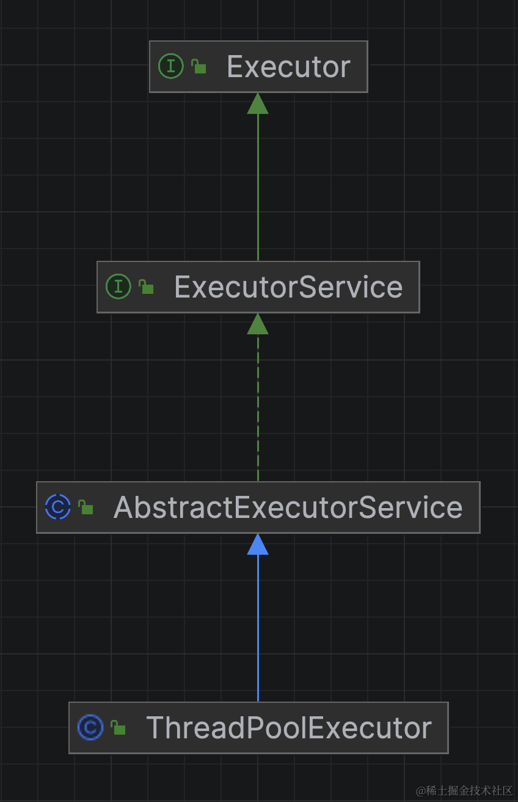

# 类继承结构

ThreadPoolExecutor源码解析，需要一定的线程池基础知识，否则这篇文章看起来会比较困难。
我们直接开门见山看类继承结构图：




可以看到，ThreadPoolExecutor实现了Executor、ExecutorService两个接口，实现了AbstractExecutorService抽象类，我们看下这些接口和抽象类中的核心方法。

## Executor

```java
public interface Executor {
    //提交Runnable任务到线程池
    void execute(Runnable command);
}
```

可以看到，ThreadPoolExecutor实现了顶级接口Executor，在该接口中仅定一个了一个方法void execute(Runnable command)。

## ExecutorService

```java
public interface ExecutorService extends Executor {
    //关闭线程池
    void shutdown();
    //也是关闭线程池，和上面的关闭相比是会立刻关闭，及时当前的任务还未执行完
    List<Runnable> shutdownNow();
    //是否已关闭
    boolean isShutdown();
    ......
    //提交一个Callable类型的任务，返回一个Future
    <T> Future<T> submit(Callable<T> task);
    //提交一个Runnable类型的任务及结果参数，返回一个Future
    <T> Future<T> submit(Runnable task, T result);
    //提交Runnable任务到线程池
    Future<?> submit(Runnable task);
    ......
}
```

## AbstractExecutorService

```java
public abstract class AbstractExecutorService implements ExecutorService {

    protected <T> RunnableFuture<T> newTaskFor(Runnable runnable, T value) {
        return new FutureTask<T>(runnable, value);
    }

    protected <T> RunnableFuture<T> newTaskFor(Callable<T> callable) {
        return new FutureTask<T>(callable);
    }

    public Future<?> submit(Runnable task) {
        if (task == null) throw new NullPointerException();
        RunnableFuture<Void> ftask = newTaskFor(task, null);
        execute(ftask);
        return ftask;
    }

    public <T> Future<T> submit(Runnable task, T result) {
        if (task == null) throw new NullPointerException();
        RunnableFuture<T> ftask = newTaskFor(task, result);
        execute(ftask);
        return ftask;
    }

    public <T> Future<T> submit(Callable<T> task) {
        if (task == null) throw new NullPointerException();
        RunnableFuture<T> ftask = newTaskFor(task);
        execute(ftask);
        return ftask;
    }
    ......
}
```

这里可以看到这些submit方法最终都是将参数封装成RunnableFuture类型的FutureTask，再交给execute方法执行。

## ThreadPoolExecutor

终于到ThreadPoolExecutor类了，我们先来看下里面的核心变量。

```java
public class ThreadPoolExecutor extends AbstractExecutorService {
    //原子变量，这里设计的比较巧妙，32位的Integer类型，高三位保存线程池的运行状态，后29位保存线程数
    //量，一个变量保存两个值，无锁化的保证了数据一致，并且使用了位运算，极致的性能
    private final AtomicInteger ctl = new AtomicInteger(ctlOf(RUNNING, 0));
    private static final int COUNT_BITS = Integer.SIZE - 3;
    private static final int CAPACITY   = (1 << COUNT_BITS) - 1;

    // runState is stored in the high-order bits
    //线程池的五种状态RUNNING < SHUTDOWN < STOP < TIDYING < TERMINATED
    //正常运行状态
    private static final int RUNNING    = -1 << COUNT_BITS;
    //关闭状态，不再接受任务，队列中未处理完的任务会继续处理
    private static final int SHUTDOWN   =  0 << COUNT_BITS;
    //不接受任务，未处理完的任务会中断
    private static final int STOP       =  1 << COUNT_BITS;
    //任务都终止了 线程数为0
    private static final int TIDYING    =  2 << COUNT_BITS;
    //执行完terminated方法后
    private static final int TERMINATED =  3 << COUNT_BITS;

    // Packing and unpacking ctl
    //当前线程池运行状态
    private static int runStateOf(int c)     { return c & ~CAPACITY; }
    //当前线程池线程数
    private static int workerCountOf(int c)  { return c & CAPACITY; }
    //传入的状态及线程数生成ctl
    private static int ctlOf(int rs, int wc) { return rs | wc; }
    private static boolean runStateLessThan(int c, int s) {
        return c < s;
    }
    private static boolean runStateAtLeast(int c, int s) {
        return c >= s;
    }
    private static boolean isRunning(int c) {
        return c < SHUTDOWN;
    }
```

# 运行机制

## execute

我们看到execute方法的具体实现

```java
public void execute(Runnable command) {
    if (command == null)
        throw new NullPointerException();
    //获取线程池运行状态
    int c = ctl.get();
    if (workerCountOf(c) < corePoolSize) {
        //如果运行线程数小于核心线程数，添加一个worker来执行任务，第二个参数true表示使用核心线程
        if (addWorker(command, true))
            //addWorker如果返回true，直接返回，如果返回false，说明添加失败，走后续处理逻辑
            return;
        c = ctl.get();
    }
    //如果线程池是Running状态，则将任务添加至队列中
    if (isRunning(c) && workQueue.offer(command)) {
        //到这里说明任务已成功进入队列，
        int recheck = ctl.get();
        //如果线程池不处于Running状态，将任务从刚刚添加的队列中移除
        if (! isRunning(recheck) && remove(command))
            //执行拒绝策略
            reject(command);
        //线程池处于Running状态&线程数量为0，开启一个线程进行处理
        else if (workerCountOf(recheck) == 0)
            addWorker(null, false);
    }
    //线程池不处于Running状态或者队列满了，添加一个worker来执行任务
    //第二个参数false表示使用非核心线程
    else if (!addWorker(command, false))
        //失败的话执行拒绝策略
        reject(command);
}
```

## worker

上面这段代码，出现了好几处addWorker方法，我们点进去看下，究竟怎么个事。

```java
private final class Worker
    extends AbstractQueuedSynchronizer
    implements Runnable
{
    /**
     * This class will never be serialized, but we provide a
     * serialVersionUID to suppress a javac warning.
     */
    private static final long serialVersionUID = 6138294804551838833L;

    /** Thread this worker is running in.  Null if factory fails. */
    final Thread thread;
    /** Initial task to run.  Possibly null. */
    Runnable firstTask;
    /** Per-thread task counter */
    volatile long completedTasks;

    /**
     * Creates with given first task and thread from ThreadFactory.
     * @param firstTask the first task (null if none)
     */
     //构造函数，传入的Runnable会赋值为Worker的firstTask，并且会new一个线程出来
    Worker(Runnable firstTask) {
        setState(-1); // inhibit interrupts until runWorker
        this.firstTask = firstTask;
        this.thread = getThreadFactory().newThread(this);
    }

    /** Delegates main run loop to outer runWorker  */
    public void run() {
        runWorker(this);
    }
```

## addWorker

可以看到，Worker继承了大名鼎鼎的AQS，并且实现了Runnable接口。我们点开addWorker方法。

```java
//第二个参数表示使用核心线程还是最大线程
private boolean addWorker(Runnable firstTask, boolean core) {
    retry:
    //一个死循环
    for (;;) {
        int c = ctl.get();
        int rs = runStateOf(c);

        // Check if queue empty only if necessary.
        //线程池状态已关闭并且不为（线程池处于SHUTDOWN且firstTask为null且队列非空）则返回false
        //逻辑很绕
        if (rs >= SHUTDOWN &&
            ! (rs == SHUTDOWN &&
               firstTask == null &&
               ! workQueue.isEmpty()))
            return false;
        //又一个死循环
        for (;;) {
            //线程池当前线程数
            int wc = workerCountOf(c);
            if (wc >= CAPACITY ||
                wc >= (core ? corePoolSize : maximumPoolSize))
                //不能再创建线程了
                return false;
            //cas操作，增加一个线程数量，如果失败，再次循环
            if (compareAndIncrementWorkerCount(c))
                break retry;
            c = ctl.get();  // Re-read ctl
            //这里考虑了并发情况下，线程池状态发生了变更，跳到外层
            if (runStateOf(c) != rs)
                continue retry;
            // else CAS failed due to workerCount change; retry inner loop
        }
    }

    boolean workerStarted = false;
    boolean workerAdded = false;
    Worker w = null;
    try {
        //构造worker
        w = new Worker(firstTask);
        final Thread t = w.thread;
        if (t != null) {
            final ReentrantLock mainLock = this.mainLock;
            //加锁，保证只有一个线程能进行下面的操作
            mainLock.lock();
            try {
                // Recheck while holding lock.
                // Back out on ThreadFactory failure or if
                // shut down before lock acquired.
                int rs = runStateOf(ctl.get());

                if (rs < SHUTDOWN ||
                    (rs == SHUTDOWN && firstTask == null)) {
                    if (t.isAlive()) // precheck that t is startable
                        throw new IllegalThreadStateException();
                    workers.add(w);
                    int s = workers.size();
                    if (s > largestPoolSize)
                        //记录最大的worker数
                        largestPoolSize = s;
                    //成功添加标识
                    workerAdded = true;
                }
            } finally {
                mainLock.unlock();
            }
            if (workerAdded) {
                //已成功添加，启动这个线程
                t.start();
                //启动成功表示
                workerStarted = true;
            }
        }
    } finally {
        //如果没有启动成功
        if (! workerStarted)
            //worker数量减1
            addWorkerFailed(w);
    }
    return workerStarted;
}
```

## runWorker

前面我们看到worker其实也是Runnable，t.start()启动后执行的run方法会执行runWorker方法，点开它。

```java
final void runWorker(Worker w) {
    Thread wt = Thread.currentThread();
    Runnable task = w.firstTask;
    w.firstTask = null;
    w.unlock(); // allow interrupts
    boolean completedAbruptly = true;
    try {
        //死循环，当firstTask不为空或者getTask()不为空
        while (task != null || (task = getTask()) != null) {
            w.lock();
            // If pool is stopping, ensure thread is interrupted;
            // if not, ensure thread is not interrupted.  This
            // requires a recheck in second case to deal with
            // shutdownNow race while clearing interrupt
            if ((runStateAtLeast(ctl.get(), STOP) ||
                 (Thread.interrupted() &&
                  runStateAtLeast(ctl.get(), STOP))) &&
                !wt.isInterrupted())
                //线程中断
                wt.interrupt();
            try {
                beforeExecute(wt, task);
                Throwable thrown = null;
                try {
                    //任务执行
                    task.run();
                } catch (RuntimeException x) {
                    //注意细节，这里三个catch抓到异常后再次抛出了异常
                    thrown = x; throw x;
                } catch (Error x) {
                    thrown = x; throw x;
                } catch (Throwable x) {
                    thrown = x; throw new Error(x);
                } finally {
                    afterExecute(task, thrown);
                }
            } finally {
                //这个任务已处理了，置为空
                task = null;
                w.completedTasks++;
                w.unlock();
            }
        }
        completedAbruptly = false;
    } finally {
        //需要关闭线程，
        //1.已经没有任务了,completedAbruptly == false
        //2.或者任务执行出现了未被捕获的异常（很重要）completedAbruptly == true
        processWorkerExit(w, completedAbruptly);
    }
}
```

## getTask

我们先看getTask()是如何获取队列中的任务

```java
private Runnable getTask() {
    boolean timedOut = false; // Did the last poll() time out?

    for (;;) {
        int c = ctl.get();
        int rs = runStateOf(c);

        // Check if queue empty only if necessary.
        if (rs >= SHUTDOWN && (rs >= STOP || workQueue.isEmpty())) {
            //线程池处于关闭或者队列为空，线程数减1，方法返回null
            decrementWorkerCount();
            return null;
        }

        int wc = workerCountOf(c);

        // Are workers subject to culling?
        boolean timed = allowCoreThreadTimeOut || wc > corePoolSize;

        if ((wc > maximumPoolSize || (timed && timedOut))
            && (wc > 1 || workQueue.isEmpty())) {
            //线程数减1
            if (compareAndDecrementWorkerCount(c))
                //cas成功直接返回
                return null;
            continue;
        }

        try {
            //获取任务
            Runnable r = timed ?
                workQueue.poll(keepAliveTime, TimeUnit.NANOSECONDS) :
                workQueue.take();
            if (r != null)
                return r;
            timedOut = true;
        } catch (InterruptedException retry) {
            timedOut = false;
        }
    }
}
```

## processWorkerExit

最后我们看下processWorkerExit方法，关闭线程。

```java
private void processWorkerExit(Worker w, boolean completedAbruptly) {
    //true:说明任务执行出现异常，将工作线程减1
    //false:没有任务，这里就不用减1了，因为前面的getTask已经减了1
    if (completedAbruptly) // If abrupt, then workerCount wasn't adjusted
        decrementWorkerCount();

    final ReentrantLock mainLock = this.mainLock;
    mainLock.lock();
    try {
        completedTaskCount += w.completedTasks;
        //从set中移除
        workers.remove(w);
    } finally {
        mainLock.unlock();
    }

    tryTerminate();

    int c = ctl.get();
    if (runStateLessThan(c, STOP)) {
        //当前线程池状态小于STOP
        if (!completedAbruptly) {
            //任务执行出现异常
            int min = allowCoreThreadTimeOut ? 0 : corePoolSize;
            if (min == 0 && ! workQueue.isEmpty())
                min = 1;
            if (workerCountOf(c) >= min)
                //如果当前线程数量不小于最小的，方法返回
                return; // replacement not needed
        }
        //添加一个非核心线程
        addWorker(null, false);
    }
}
```

这里我们要明白一个道理，当线程池中的线程在执行任务时出现了没有被捕获的异常，会导致这个当前这个线程回收，剩余线程不够用的时候，会创建一个新的线程。如果异常经常出现的话，会导致线程池频繁创建线程，增加资源开销，所以我们将任务交给线程池处理时最好的加一层try-catch捕获异常。

# 总结

这篇文章花了较大篇幅从源码上分析了ThreadPoolExecutor的核心实现原理，希望能够帮助大家对java线程池的学习。

本人掘金文章链接 ：[ThreadPoolExecutor源码解析](https://juejin.cn/post/7327124869921079311)

