## 前言

公司服务中引入了Nacos做配置中心，通过@RefreshScope注解可实现配置实时刷新。在某个AOP切面中发现使用@RefreshScope后，切面方法重复执行了两次，什么原因导致的呢？

Tips:需要spring aop源码基础，否则很难看懂。

## 测试demo

```Java
@Aspect
@Component
@RefreshScope
public class TestAspect {

    @Value("${abcde.huang}")
    private String name;

    @Pointcut("execution(public * com.ht.service.impl.TestService.sayHelloByName(..))")
    public void sayHelloByName() {
    }

    @Before("sayHelloByName()")
    public void beforeSelect(JoinPoint point) {
        System.out.println("aop"+name);
    }
}
```

```java
@Service
public class TestServiceImpl implements TestService {

    @Override
    public String sayHelloByName(String name) {
        return name + ",hello!";
    }
}
```

```java
@SpringBootApplication
public class Application {

    public static void main(String[] args) {
        ConfigurableApplicationContext run = SpringApplication.run(Application.class, args);
        TestService bean = run.getBean(TestService.class);
        bean.sayHelloByName("test");
    }
}
```

## 源码分析

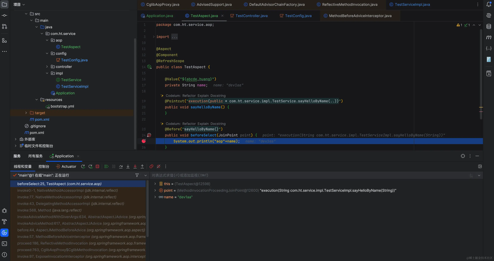

AOP第一次增强，往上看在哪里执行的

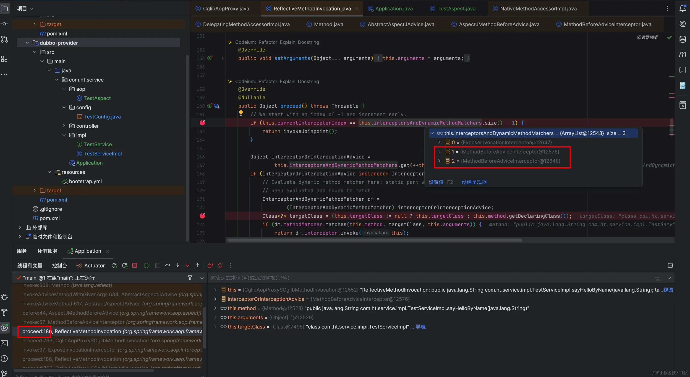

这里感觉很诡异，测试demo里只有一处使用了aop，不应该是两个，我们继续往上看，这个List在哪构造的

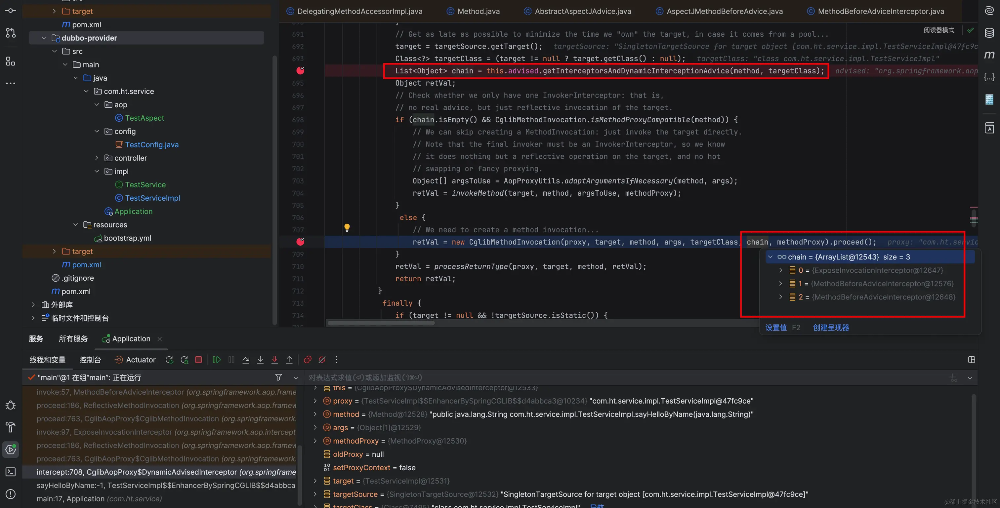

继续往上看，重点关注这个this.advised.getInterceptorsAndDynamicInterceptionAdvice方法。

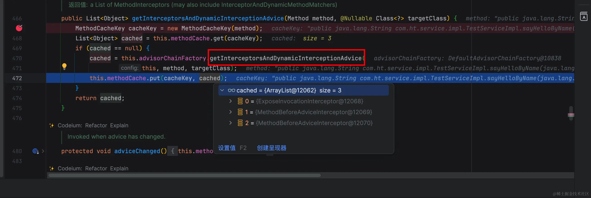

继续往里面看

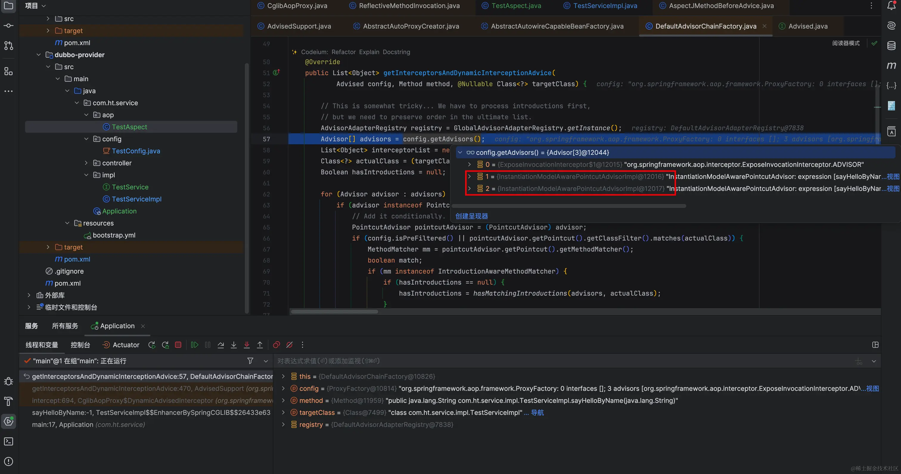

```java
private List<Advisor> advisors = new ArrayList<>();
@Override
public final Advisor[] getAdvisors() {
    return this.advisors.toArray(new Advisor[0]);
}
public void addAdvisors(Collection<Advisor> advisors) {
    if (isFrozen()) {
       throw new AopConfigException("Cannot add advisor: Configuration is frozen.");
    }
    if (!CollectionUtils.isEmpty(advisors)) {
       for (Advisor advisor : advisors) {
          if (advisor instanceof IntroductionAdvisor) {
             validateIntroductionAdvisor((IntroductionAdvisor) advisor);
          }
          Assert.notNull(advisor, "Advisor must not be null");
          this.advisors.add(advisor);
       }
       adviceChanged();
    }
}
```

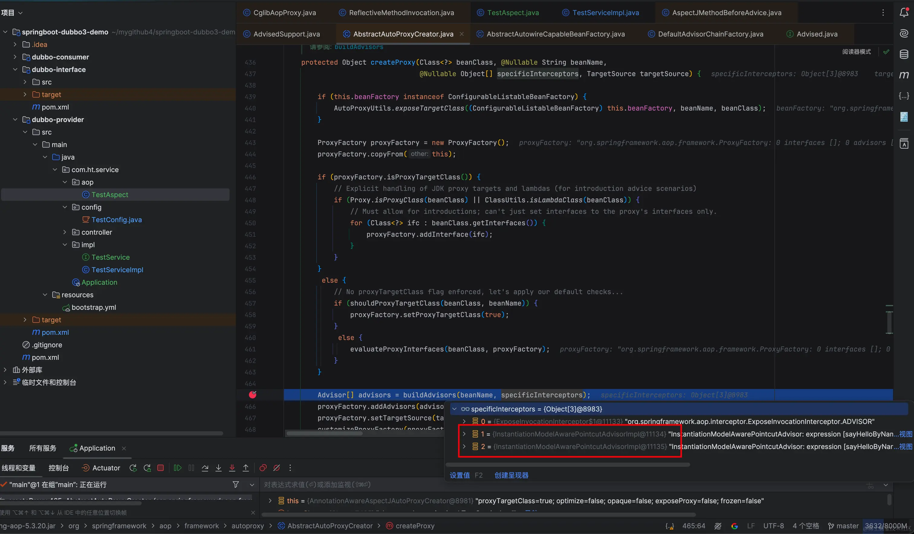

<br>

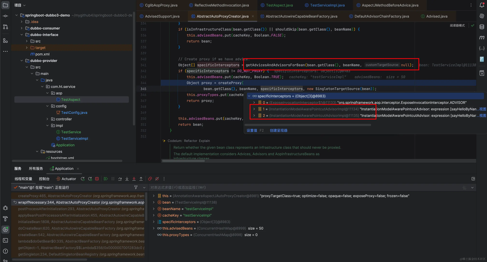

<br>

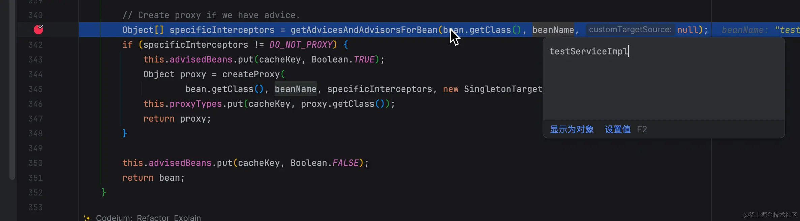

<br>

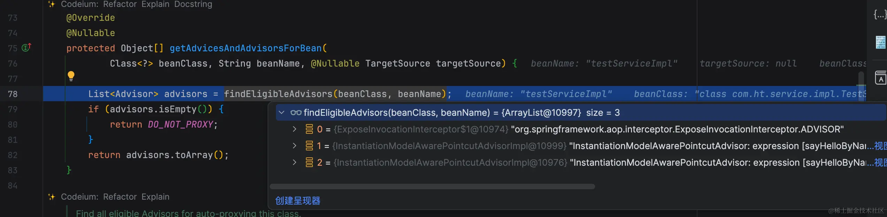

<br>

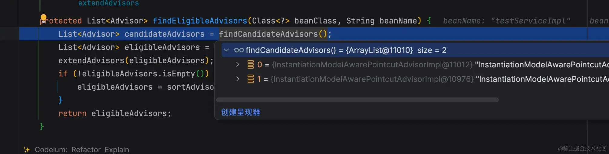

<br>

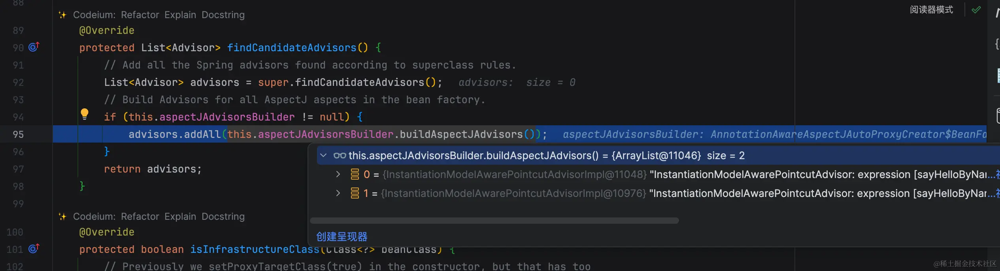

<br>

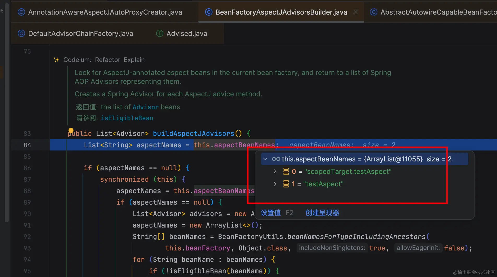

到这里问题已经很清楚了，spring中存在两个“testAspect”bean,导致aop责任链重复执行切面方法。

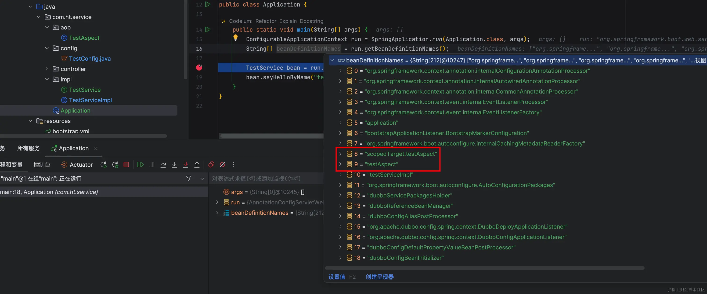

这里也进一步验证了前面的分析。

## 总结

当我们在实际项目中遇到问题时，往往并不清楚问题的关键所在。本文采用打断点的方法，逐层从下而上分析源代码，以找出问题的根源。
当切面类TestAspect（加了@Aspect）加上@RefreshScope时后会生成scopedTarget.testAspect和testAspect两个bean，造成切面方法执行两次。具体@RefreshScope为什么会额外生成scopedTarget.testAspect这个bean，我将在另一篇文章中解析。

本人掘金文章链接 ：[@RefreshScope导致AOP切面重复执行源码分析](https://juejin.cn/post/7347617413984960546)


