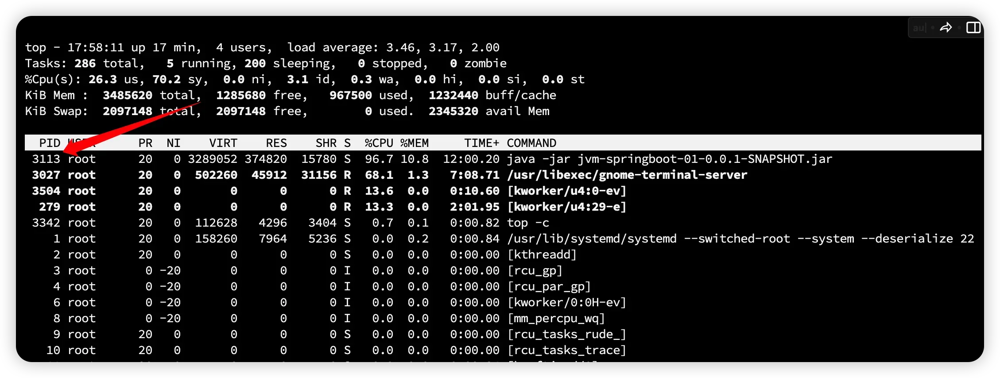
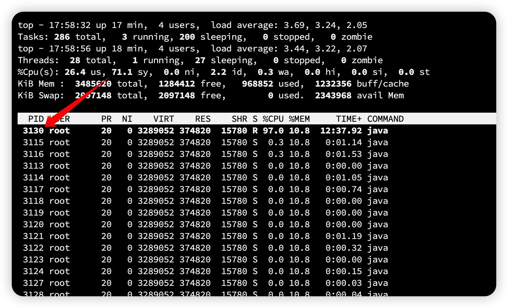
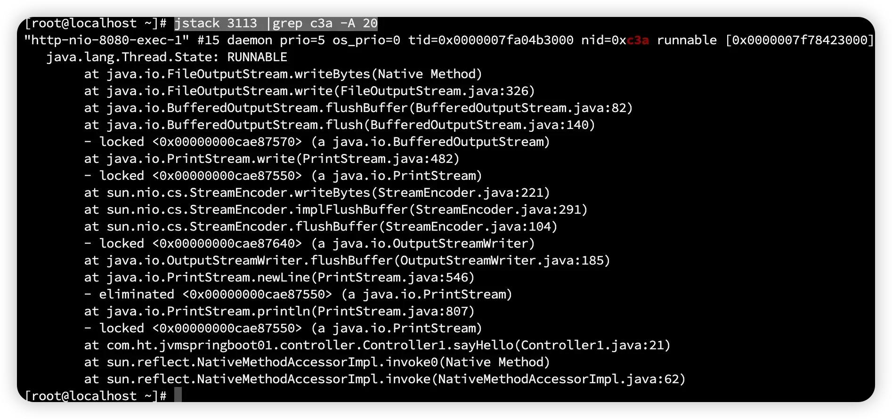

## 问题代码

```java
//一个简单的死循环代码
@GetMapping("/sayHello")
public String sayHello() throws InterruptedException {
    while (true) {
        System.out.println("a");
    }
}
```

## Linux原生工具：

```bash
#使用linux命令工具top查看系统进程cpu使用情况
top -c
```



```bash
#进一步查看进程3113下各线程cpu使用情况
top -Hp 3113
```



```bash
#转成16机制	c3a
printf "%x\n" 3130			
```

```bash
#输出线程堆栈信息
jstack 3113 |grep c3a -A 20
```



## arthas：

```bash
#使用工具arthas输出java进程中cpu使用前三的线程堆栈信息
thread -n 3 -i 1000
```

```java
[arthas@4351]
$ thread -n 3-i 1000
        "http-nio-8080-exec-1"Id=19cpuUsage=76.89%deltaTime=773
ms time = 132176
ms RUNNABLE
at java.io.FileOutputStream.

writeBytes(Native Method)

at java.io.FileOutputStream.

write(FileOutputStream.java:326)

at java.io.BufferedOutputStream.

flushBuffer(BufferedOutputStream.java:82)

at java.io.BufferedOutputStream.

flush(BufferedOutputStream.java:140)

at java.io.PrintStream.

write(PrintStream.java:482)

at sun.nio.cs.StreamEncoder.

writeBytes(StreamEncoder.java:221)

at sun.nio.cs.StreamEncoder.

implFlushBuffer(StreamEncoder.java:291)

at sun.nio.cs.StreamEncoder.

flushBuffer(StreamEncoder.java:104)

at java.io.OutputStreamWriter.

flushBuffer(OutputStreamWriter.java:185)

at java.io.PrintStream.

newLine(PrintStream.java:546)

at java.io.PrintStream.

println(PrintStream.java:807)

at com.ht.jvmspringboot01.controller.Controller1.

sayHello(Controller1.java:21)

at sun.reflect.NativeMethodAccessorImpl.

invoke0(Native Method)

at sun.reflect.NativeMethodAccessorImpl.

invoke(NativeMethodAccessorImpl.java:62)

at sun.reflect.DelegatingMethodAccessorImpl.

invoke(DelegatingMethodAccessorImpl.java:43)

at java.lang.reflect.Method.

invoke(Method.java:498)

at org.springframework.web.method.support.InvocableHandlerMethod.

doInvoke(InvocableHandlerMethod.java:205)

at org.springframework.web.method.support.InvocableHandlerMethod.

invokeForRequest(InvocableHandlerMethod.java:150)

at org.springframework.web.servlet.mvc.method.annotation.ServletInvocableHandlerMethod.

invokeAndHandle(ServletInvocableHandlerMethod.java:117)

at org.springframework.web.servlet.mvc.method.annotation.RequestMappingHandlerAdapter.

invokeHandlerMethod(RequestMappingHandlerAdapter.java:895)

at org.springframework.web.servlet.mvc.method.annotation.RequestMappingHandlerAdapter.

handleInternal(RequestMappingHandlerAdapter.java:808)

at org.springframework.web.servlet.mvc.method.AbstractHandlerMethodAdapter.

handle(AbstractHandlerMethodAdapter.java:87)

at org.springframework.web.servlet.DispatcherServlet.

doDispatch(DispatcherServlet.java:1072)

at org.springframework.web.servlet.DispatcherServlet.

doService(DispatcherServlet.java:965)

at org.springframework.web.servlet.FrameworkServlet.

processRequest(FrameworkServlet.java:1006)

at org.springframework.web.servlet.FrameworkServlet.

doGet(FrameworkServlet.java:898)

at javax.servlet.http.HttpServlet.

service(HttpServlet.java:529)

at org.springframework.web.servlet.FrameworkServlet.

service(FrameworkServlet.java:883)

at javax.servlet.http.HttpServlet.

service(HttpServlet.java:623)

at org.apache.catalina.core.ApplicationFilterChain.

internalDoFilter(ApplicationFilterChain.java:209)

at org.apache.catalina.core.ApplicationFilterChain.

doFilter(ApplicationFilterChain.java:153)

at org.apache.tomcat.websocket.server.WsFilter.

doFilter(WsFilter.java:51)

at org.apache.catalina.core.ApplicationFilterChain.

internalDoFilter(ApplicationFilterChain.java:178)

at org.apache.catalina.core.ApplicationFilterChain.

doFilter(ApplicationFilterChain.java:153)

at org.springframework.web.filter.RequestContextFilter.

doFilterInternal(RequestContextFilter.java:100)

at org.springframework.web.filter.OncePerRequestFilter.

doFilter(OncePerRequestFilter.java:117)

at org.apache.catalina.core.ApplicationFilterChain.

internalDoFilter(ApplicationFilterChain.java:178)

at org.apache.catalina.core.ApplicationFilterChain.

doFilter(ApplicationFilterChain.java:153)

at org.springframework.web.filter.FormContentFilter.

doFilterInternal(FormContentFilter.java:93)

at org.springframework.web.filter.OncePerRequestFilter.

doFilter(OncePerRequestFilter.java:117)

at org.apache.catalina.core.ApplicationFilterChain.

internalDoFilter(ApplicationFilterChain.java:178)

at org.apache.catalina.core.ApplicationFilterChain.

doFilter(ApplicationFilterChain.java:153)

at org.springframework.web.filter.CharacterEncodingFilter.

doFilterInternal(CharacterEncodingFilter.java:201)

at org.springframework.web.filter.OncePerRequestFilter.

doFilter(OncePerRequestFilter.java:117)

at org.apache.catalina.core.ApplicationFilterChain.

internalDoFilter(ApplicationFilterChain.java:178)

at org.apache.catalina.core.ApplicationFilterChain.

doFilter(ApplicationFilterChain.java:153)

at org.apache.catalina.core.StandardWrapperValve.

invoke(StandardWrapperValve.java:167)

at org.apache.catalina.core.StandardContextValve.

invoke(StandardContextValve.java:90)

at org.apache.catalina.authenticator.AuthenticatorBase.

invoke(AuthenticatorBase.java:481)

at org.apache.catalina.core.StandardHostValve.

invoke(StandardHostValve.java:130)

at org.apache.catalina.valves.ErrorReportValve.

invoke(ErrorReportValve.java:93)

at org.apache.catalina.core.StandardEngineValve.

invoke(StandardEngineValve.java:74)

at org.apache.catalina.connector.CoyoteAdapter.

service(CoyoteAdapter.java:343)

at org.apache.coyote.http11.Http11Processor.

service(Http11Processor.java:390)

at org.apache.coyote.AbstractProcessorLight.

process(AbstractProcessorLight.java:63)

at org.apache.coyote.AbstractProtocol$ConnectionHandler.

process(AbstractProtocol.java:926)

at org.apache.tomcat.util.net.NioEndpoint$SocketProcessor.

doRun(NioEndpoint.java:1791)

at org.apache.tomcat.util.net.SocketProcessorBase.

run(SocketProcessorBase.java:52)

at org.apache.tomcat.util.threads.ThreadPoolExecutor.

runWorker(ThreadPoolExecutor.java:1191)

at org.apache.tomcat.util.threads.ThreadPoolExecutor$Worker.

run(ThreadPoolExecutor.java:659)

at org.apache.tomcat.util.threads.TaskThread$WrappingRunnable.

run(TaskThread.java:61)

at java.lang.Thread.

run(Thread.java:750)


"arthas-command-execute"Id=53cpuUsage=0.04%deltaTime=0
ms time = 13
ms RUNNABLE
at sun.management.ThreadImpl.

dumpThreads0(Native Method)

at sun.management.ThreadImpl.

getThreadInfo(ThreadImpl.java:461)

at com.taobao.arthas.core.command.monitor200.ThreadCommand.

processTopBusyThreads(ThreadCommand.java:206)

at com.taobao.arthas.core.command.monitor200.ThreadCommand.

process(ThreadCommand.java:122)

at com.taobao.arthas.core.shell.command.impl.AnnotatedCommandImpl.

process(AnnotatedCommandImpl.java:82)

at com.taobao.arthas.core.shell.command.impl.AnnotatedCommandImpl.

access$100(AnnotatedCommandImpl.java:18)

at com.taobao.arthas.core.shell.command.impl.AnnotatedCommandImpl$ProcessHandler.

handle(AnnotatedCommandImpl.java:111)

at com.taobao.arthas.core.shell.command.impl.AnnotatedCommandImpl$ProcessHandler.

handle(AnnotatedCommandImpl.java:108)

at com.taobao.arthas.core.shell.system.impl.ProcessImpl$CommandProcessTask.

run(ProcessImpl.java:385)

at java.util.concurrent.Executors$RunnableAdapter.

call(Executors.java:511)

at java.util.concurrent.FutureTask.

run(FutureTask.java:266)

at java.util.concurrent.ScheduledThreadPoolExecutor$ScheduledFutureTask.

access$201(ScheduledThreadPoolExecutor.java:180)

at java.util.concurrent.ScheduledThreadPoolExecutor$ScheduledFutureTask.

run(ScheduledThreadPoolExecutor.java:293)

at java.util.concurrent.ThreadPoolExecutor.

runWorker(ThreadPoolExecutor.java:1149)

at java.util.concurrent.ThreadPoolExecutor$Worker.

run(ThreadPoolExecutor.java:624)

at java.lang.Thread.

run(Thread.java:750)


"C1 CompilerThread3"[Internal]cpuUsage=0.03%deltaTime=0
ms time = 412
ms
```

