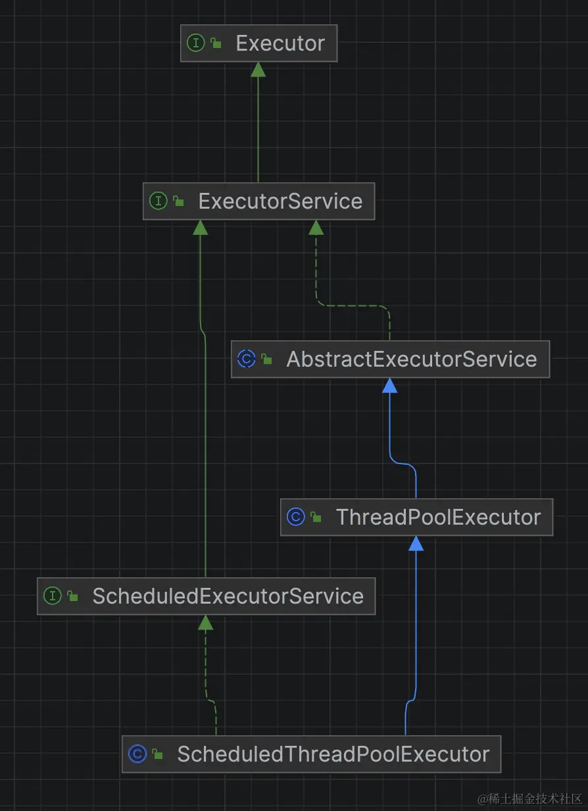

## 前言

之前公司有小部分数据需要跨服务同步，由于数据一致性要求不高，并且数据量很少，当时仅使用了定时线程池ScheduledThreadPoolExecutor进行拉取，但在某天运营反馈数据一直没有同步到，当时通过日志定位到定时线程池的任务并没有按时执行，在重新发布后服务后，任务又可以按时执行了。后面通过测试发现，当任务抛出异常后，定时任务后续便不会再执行，为什么会出现这种情况呢，我们点开ScheduledThreadPoolExecutor源码一探究竟。

## 故障复现

```java
public class Test1 {
    static ScheduledExecutorService executor = new ScheduledThreadPoolExecutor(1);

    public static void main(String[] args) throws InterruptedException {
        AtomicInteger count = new AtomicInteger();
        executor.scheduleAtFixedRate(new Runnable() {
            @Override
            public void run() {
                count.addAndGet(1);
                System.out.println("定时任务执行" + count.get());
                if (count.get() == 5) {
                    throw new RuntimeException();
                }
            }
        }, 3, 1, TimeUnit.SECONDS);//启动后延迟3s，1s执行一次
        new CountDownLatch(1).await();
    }
}
```

上面是我们的测试demo，我们会看到下面的执行结果，任务在执行5次后抛出异常，后续任务便不再执行。

```shell
定时任务执行1
定时任务执行2
定时任务执行3
定时任务执行4
定时任务执行5
```

## 源码分析



```java
public ScheduledThreadPoolExecutor(int corePoolSize) {
    super(corePoolSize, Integer.MAX_VALUE, 0, NANOSECONDS,
            new DelayedWorkQueue());
}
```

从类继承结构图和构造函数可以看到，ScheduledThreadPoolExecutor其实就是一个使用了延时队列的的线程池。

```java
public ScheduledFuture<?> scheduleAtFixedRate(Runnable command,
                                              long initialDelay,
                                              long period,
                                              TimeUnit unit) {
    if (command == null || unit == null)
        throw new NullPointerException();
    if (period <= 0)
        throw new IllegalArgumentException();
    ScheduledFutureTask<Void> sft =
            new ScheduledFutureTask<Void>(command,
                    null,
                    triggerTime(initialDelay, unit),
                    unit.toNanos(period));
    RunnableScheduledFuture<Void> t = decorateTask(command, sft);
    sft.outerTask = t;
    delayedExecute(t);
    return t;
}
```

这里出现了一个ScheduledFutureTask，点进去看下。

```java
private class ScheduledFutureTask<V>
        extends FutureTask<V> implements RunnableScheduledFuture<V> {
    private final long sequenceNumber;
    private long time;
    private final long period;
    RunnableScheduledFuture<V> outerTask = this;
    int heapIndex;

    ScheduledFutureTask(Runnable r, V result, long ns) {
        super(r, result);
        this.time = ns;
        this.period = 0;
        this.sequenceNumber = sequencer.getAndIncrement();
    }

    ScheduledFutureTask(Runnable r, V result, long ns, long period) {
        super(r, result);
        this.time = ns;
        this.period = period;
        this.sequenceNumber = sequencer.getAndIncrement();
    }

    ScheduledFutureTask(Callable<V> callable, long ns) {
        super(callable);
        this.time = ns;
        this.period = 0;
        this.sequenceNumber = sequencer.getAndIncrement();
    }

    public long getDelay(TimeUnit unit) {
        return unit.convert(time - now(), NANOSECONDS);
    }

    public int compareTo(Delayed other) {
        if (other == this) // compare zero if same object
            return 0;
        if (other instanceof ScheduledFutureTask) {
            ScheduledFutureTask<?> x = (ScheduledFutureTask<?>) other;
            long diff = time - x.time;
            if (diff < 0)
                return -1;
            else if (diff > 0)
                return 1;
            else if (sequenceNumber < x.sequenceNumber)
                return -1;
            else
                return 1;
        }
        long diff = getDelay(NANOSECONDS) - other.getDelay(NANOSECONDS);
        return (diff < 0) ? -1 : (diff > 0) ? 1 : 0;
    }

    public boolean isPeriodic() {
        return period != 0;
    }

    private void setNextRunTime() {
        long p = period;
        if (p > 0)
            time += p;
        else
            time = triggerTime(-p);
    }

    public boolean cancel(boolean mayInterruptIfRunning) {
        boolean cancelled = super.cancel(mayInterruptIfRunning);
        if (cancelled && removeOnCancel && heapIndex >= 0)
            remove(this);
        return cancelled;
    }

    public void run() {
        //是否是周期性的
        boolean periodic = isPeriodic();
        if (!canRunInCurrentRunState(periodic))
            cancel(false);
        else if (!periodic)
            //如果不是，直接执行就可以
            ScheduledFutureTask.super.run();
        else if (ScheduledFutureTask.super.runAndReset()) {
            //如果是周期性的任务，执行完设置下次执行时间
            setNextRunTime();
            //将任务重新放回队列
            reExecutePeriodic(outerTask);
        }
    }
}
```

```java
//任务执行代码
protected boolean runAndReset() {
    if (state != NEW ||
            !UNSAFE.compareAndSwapObject(this, runnerOffset,
                    null, Thread.currentThread()))
        return false;
    boolean ran = false;
    int s = state;
    try {
        Callable<V> c = callable;
        if (c != null && s == NEW) {
            try {
                //这里会执行提交到线程池的任务
                c.call(); // don't set result
                ran = true;
            } catch (Throwable ex) {
                //出现异常后 ran的值不会变成true
                setException(ex);
            }
        }
    } finally {
        // runner must be non-null until state is settled to
        // prevent concurrent calls to run()
        runner = null;
        // state must be re-read after nulling runner to prevent
        // leaked interrupts
        s = state;
        if (s >= INTERRUPTING)
            handlePossibleCancellationInterrupt(s);
    }
    //异常后这里会返回false
    return ran && s == NEW;
}
```

## 解决

上面两段代码我们可以看到，当周期性任务出现异常后，任务不会重新放回延时队列，导致后续都不会再执行。
如何解决呢？其实很简单，提交的任务我们都用try catch进行异常捕获就行了。

```java
public class Test1 {
    static ScheduledExecutorService executor = new ScheduledThreadPoolExecutor(1);

    public static void main(String[] args) throws InterruptedException {
        AtomicInteger count = new AtomicInteger();
        executor.scheduleAtFixedRate(new Runnable() {
            @Override
            public void run() {
                try {
                    count.addAndGet(1);
                    System.out.println("定时任务执行" + count.get());
                    if (count.get() == 5) {
                        throw new RuntimeException();
                    }
                } catch (Exception e) {
                    //日志打印
                }
            }
        }, 3, 1, TimeUnit.SECONDS);//启动后延迟3s，1s执行一次
        new CountDownLatch(1).await();
    }
}
```

本人掘金文章链接 ：[我的定时任务怎么消失了？](https://juejin.cn/post/7340636105765208116)


